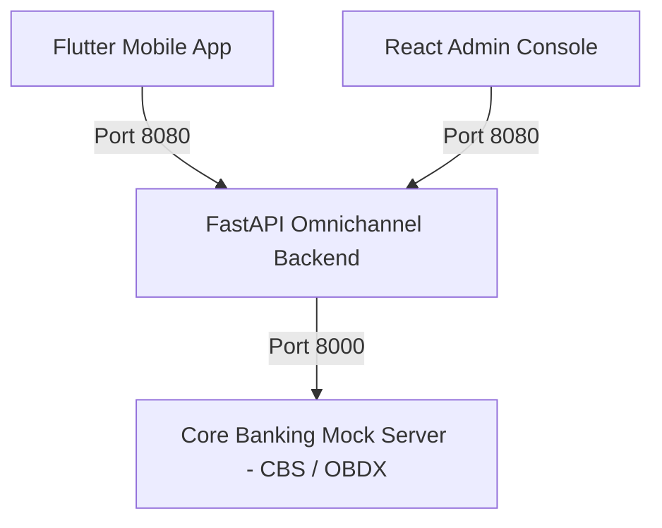

# Bharat Bank Omnichannel Banking Backend Platform

This repository hosts the **Core Banking System (CBS)** and the **Omnichannel Digital Banking Backend** powering the **Flutter Mobile App (Retail & Corporate)** and the **React Admin Console**.

---

## 🏛️ Architecture Overview



1. **CBS & OBDX Mock Server (`:8000`)**:
   - Oracle FLEXCUBE & OBDX/RPM integration contracts (Collections v1, v2, v3).
   - Swagger UI: [http://localhost:8000/docs](http://localhost:8000/docs)
2. **Omnichannel Digital Banking Backend (`:8080`)**:
   - **Collection 1 (Flutter App):** Dynamic Theming, Versioning, Composite Dashboard, Accounts 360, Fund Transfers (Within Bank, IMPS, NEFT, RTGS), Beneficiary Directory, Cards, Term Deposits, Loans, BBPS Utilities, Cheque Services, and Offline ePassbook.
   - **Collection 2 (React Admin):** Admin User/Role Management (US-20), Customer & CIF Linkage (US-21), Payment Authorization Matrix & Corporate Hierarchies (US-22), Switch Operations, Service Requests, Dynamic Theme Studio, and Audit Reports (US-23).
   - Multi-Collection Swagger UI with Dropdown: [http://localhost:8080/docs](http://localhost:8080/docs)

---

## 🚀 Running with Docker (Single Command)

To run both servers in Docker:

```bash
docker compose up --build
```

To run in the background:
```bash
docker compose up -d
```

To stop:
```bash
docker compose down
```

---

## 💻 Local Run (Without Docker)

To run both servers locally:
```bash
./run_all.sh
```

Or run the Digital Backend independently:
```bash
./venv/bin/uvicorn digital_backend.main:app --host 0.0.0.0 --port 8080 --reload
```

---

## 🧪 Testing

Execute the automated integration test suite:
```bash
./venv/bin/python3 test_digital_backend.py
```

Refer to [`apispec.md`](apispec.md) for full endpoint specifications, payloads, and PRD user story alignments.
