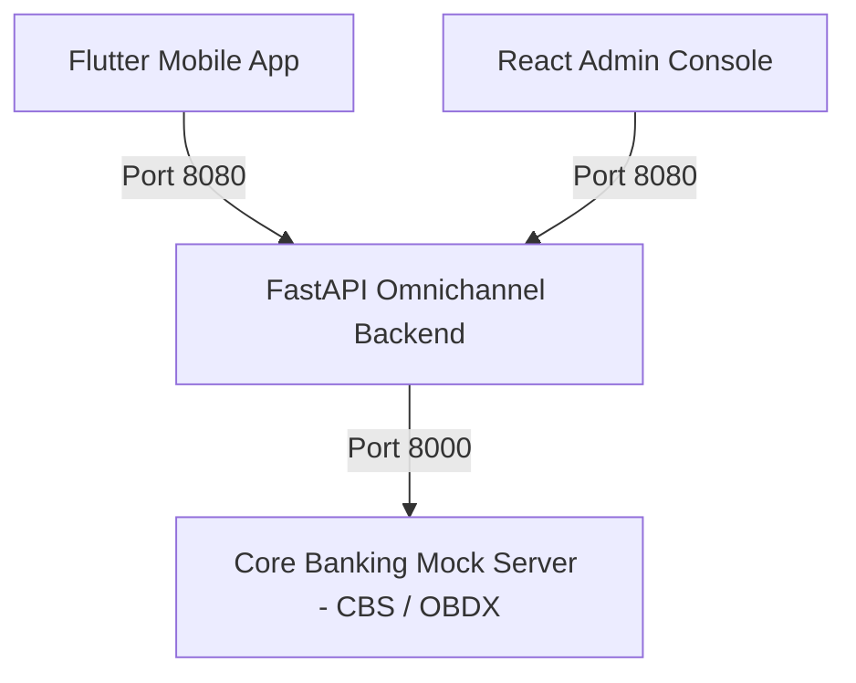

# Bharat Bank Omnichannel Banking Backend Platform

This repository hosts the **Core Banking System (CBS)** and the **Omnichannel Digital Banking Backend** powering the **Flutter Mobile App (Retail & Corporate)** and the **React Admin Console**.

---

## 🏛️ Architecture Overview



1. **CBS & OBDX Mock Server (`:8000`)**:
   - Oracle FLEXCUBE & OBDX/RPM integration contracts (Collections v1, v2, v3).
   - Swagger UI: [http://localhost:8000/docs](http://localhost:8000/docs)
2. **Omnichannel Digital Banking Backend (`:8080`)**:
   - **Collection 1 (Flutter App v2 - Latest Superset):** Base `/api/v2/app`. Full superset of mobile APIs plus Server-side Logout (`POST /auth/logout`), Customer Profile 360 (`GET /profile`), In-App Notifications Stream & Read Tracking (`GET /notifications`, `PUT /notifications/{id}/read`), Online Recurring Deposit creation (`POST /deposits/open-rd`), Scheduled Bill Payments (`POST /bills/schedule`), Recurring Auto-Pay Mandates (`POST /bills/recurring`), Registered Billers Management (`GET /bills/registered-billers`, `DELETE /bills/registered-billers/{id}`), and Real-Time Bill Payment Status (`GET /bills/{transaction_id}/status`).
   - **Collection 2 (Flutter App v1 - Legacy):** Base `/api/v1/app`. Preserved intact for existing mobile builds.
   - **Collection 3 (React Admin Console):** Base `/api/v1/admin`. Admin User/Role Management (US-20), Customer & CIF Linkage (US-21), Payment Authorization Matrix & Corporate Hierarchies (US-22), Switch Operations, Service Requests, CBS Account Servicing, Loan Underwriting, Cheque Clearing, and Audit Reports (US-23).
   - Multi-Collection Swagger UI with Dropdown: [http://localhost:8080/docs](http://localhost:8080/docs)

---

## 🚀 Running with Docker (Single Command)

To run both servers in Docker:

```bash
docker compose up --build
```

To run in the background:
```bash
docker compose up -d
```

### Running on Custom Host Ports (e.g. Ports 3010 and 3011)

You can specify custom ports via environment variables:

```bash
CBS_PORT=3010 DIGITAL_PORT=3011 docker compose up -d --build
```

Or by creating a `.env` file:
```bash
cp .env.example .env
# Edit CBS_PORT=3010 and DIGITAL_PORT=3011 in .env
docker compose up -d --build
```

After starting:
- **CBS Server**: `http://<server-ip>:3010/docs`
- **Omnichannel Digital Backend**: `http://<server-ip>:3011/docs`

To stop:
```bash
docker compose down
```

---

## 💻 Local Run (Without Docker)

To run both servers locally:
```bash
./run_all.sh
```

Or run the Digital Backend independently:
```bash
./venv/bin/uvicorn digital_backend.main:app --host 0.0.0.0 --port 8080 --reload
```

---

## 🧪 Testing

Execute the automated integration test suite:
```bash
./venv/bin/python3 test_digital_backend.py
```

Refer to [`apispec.md`](apispec.md) for full endpoint specifications, payloads, and PRD user story alignments.
